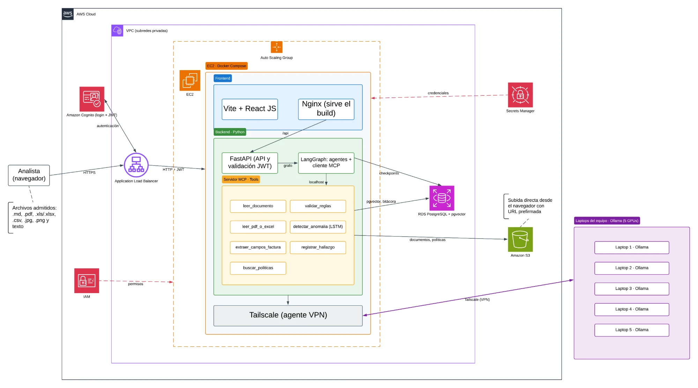

# Data Steward Agéntico · Banamex

MVP de un sistema multiagente que ayuda a los analistas de Banamex a revisar documentos, detectar inconsistencias y explicar cada recomendación con evidencia y trazabilidad.

> **El agente recomienda, la persona decide.** El sistema no aprueba, no libera pagos y no ejecuta operaciones: siempre deja la decisión final en manos de una persona autorizada.

---

## Tabla de contenido

1. [El problema](#el-problema)
2. [La solución](#la-solución)
3. [Arquitectura](#arquitectura)
4. [Flujo de un caso](#flujo-de-un-caso)
5. [Tools del servidor MCP](#tools-del-servidor-mcp)
6. [Memoria, contexto y RAG](#memoria-contexto-y-rag)
7. [Modelos e inferencia](#modelos-e-inferencia)
8. [Seguridad](#seguridad)
9. [Decisiones de diseño](#decisiones-de-diseño)
10. [Pendientes](#pendientes)

---

## El problema

Los analistas de Banamex revisan a mano facturas, registros y documentos contra reglas y políticas internas. Ese trabajo implica mucha captura manual, es lento y deja pasar errores. Además, cada decisión tiene que poder justificarse y auditarse después.

## La solución

Un **Data Steward Agéntico**: agentes de IA orquestados con LangGraph que extraen datos, consultan las políticas vigentes, aplican validaciones exactas y presentan al analista un dictamen explicado, que el analista revisa antes de decidir.

### Principios

- **Cada recomendación es verificable.** Se muestran la evidencia, la regla aplicada y su versión, y el analista puede consultar el documento original.
- **Todo queda registrado** en una bitácora de auditoría.
- **Sin acciones operativas.** No existe ninguna herramienta para liberar pagos.
- **Incertidumbre explícita.** Si falta evidencia o hay dudas, el agente lo señala y pide revisión humana.
- **Las validaciones exactas las hace el código, no el LLM.** Sumas, campos obligatorios y formatos se comprueban con código determinista.

### Historias de usuario

| # | Rol | Necesidad | Ejemplo | Valor |
|---|---|---|---|---|
| 1 | Analista de cuentas por pagar | Cargar una factura y obtener sus datos estructurados, la revisión de las reglas aplicables y la explicación de las inconsistencias | El total no coincide con subtotal más impuestos y el agente muestra la diferencia | Menos captura manual y mejor revisión de excepciones |
| 2 | Analista de datos | Validar documentos o registros contra políticas internas autorizadas | A un registro le falta un campo obligatorio y el agente indica cuál falta y qué regla lo exige | Cumplimiento consistente y trazable |

> Los documentos y las políticas concretas de la Historia 2 están **por acordar con Banamex**.

### Resultado de cada caso

Cada caso se clasifica como:

- **Aceptado**
- **Rechazado**
- **Requiere revisión humana**

Estas etiquetas indican si se cumplen las reglas evaluadas. **No equivalen a una aprobación operativa.**

### Datos del piloto

- **Facturas:** dataset **FATURA**, con 10,000 facturas sintéticas, 50 diseños y anotaciones estructuradas. No son CFDI mexicanos reales, así que las reglas del piloto se definen de forma explícita.
- **Detección de anomalías:** una **LSTM** (a petición del socio formador) funciona como modelo auxiliar. No interpreta instrucciones, no recupera políticas y no justifica decisiones.
- Solo se usan **datos sintéticos o autorizados**.

### Cómo se mide el éxito

Las metas se fijan **después de medir una línea base**. Se comparan los mismos casos con y sin agente en tres aspectos:

- Tiempo de revisión.
- Errores identificados.
- Utilidad de las recomendaciones, según los analistas.

---

## Arquitectura



Diagrama editable en Lucid: <https://lucid.app/lucidchart/eca7df1a-1982-4ecb-8609-dffa9917eb37/edit>

### Vista general

```
Analista (navegador)
      │  HTTPS
      ▼
 Application Load Balancer ◄──► Amazon Cognito (login y JWT)
      │  HTTP + JWT
      ▼
┌──────────── Auto Scaling Group (varias instancias idénticas) ────────────┐
│  EC2 · Docker Compose                                                    │
│   ├─ frontend : Nginx + build de Vite + React JS                         │
│   ├─ backend  : FastAPI + LangGraph (cliente MCP)                        │
│   └─ mcp      : Servidor MCP con las tools                               │
│  Tailscale (agente VPN, instalado en la instancia)                       │
└───────┬───────────────────────────┬───────────────────────┬──────────────┘
        │                           │                       │ Tailscale (VPN)
        ▼                           ▼                       ▼
 RDS PostgreSQL + pgvector     Amazon S3          Laptops del equipo (5 GPUs)
 (estado, vectores, bitácora)  (archivos)          con Ollama
```

Servicios de apoyo: **Secrets Manager** guarda las credenciales e **IAM** gestiona los permisos.

### Stack tecnológico

| Capa | Tecnología |
|---|---|
| Nube | AWS |
| Entrada | Application Load Balancer + Auto Scaling Group |
| Autenticación | Amazon Cognito (login y JWT) |
| Frontend | Vite + React JS, servido por Nginx |
| Backend | Python: FastAPI + LangGraph |
| Herramientas de los agentes | Servidor MCP (Model Context Protocol) |
| Base de datos | Amazon RDS PostgreSQL + pgvector |
| Almacenamiento de archivos | Amazon S3 |
| Inferencia (LLM, visión y embeddings) | Ollama en 5 laptops con GPU |
| Red privada hacia las GPUs | Tailscale |
| Secretos y permisos | AWS Secrets Manager + IAM |
| Empaquetado | Docker Compose |

### Componentes y estado de cada decisión

**Decidido** significa que el equipo ya lo eligió. **Propuesto** significa que se sugirió y falta confirmarlo.

| Componente | Función | Estado |
|---|---|---|
| AWS | Nube del proyecto | Decidido |
| ALB con Auto Scaling Group | Entrada HTTPS y réplica de la instancia | Decidido |
| Cognito | Login y emisión del JWT | Decidido |
| EC2 (una instancia por réplica, con cliente y servidor MCP) | Aloja el frontend, el backend y el MCP | Decidido |
| FastAPI + LangGraph | API y orquestación multiagente | Decidido |
| Vite + React JS | Interfaz del analista | Decidido |
| RDS PostgreSQL + pgvector | Datos, vectores del RAG, estado del grafo y bitácora | Decidido |
| Tailscale | VPN entre la instancia y las laptops | Decidido |
| Ollama en las laptops del equipo | Inferencia del LLM, visión y embeddings | Decidido |
| S3 | Archivos originales, políticas y pesos de la LSTM | Decidido |
| IAM | Permisos (los roles se definen más adelante) | Decidido |
| Nginx | Sirve el build del frontend y redirige `/api` al backend | Propuesto |
| Docker Compose con tres contenedores | Empaquetado y arranque de cada instancia | Propuesto |
| Auto Scaling en 2 zonas, mínimo 1 y máximo 3 instancias | Configuración inicial | Propuesto |
| Secrets Manager | Credenciales de la base y clave de Tailscale | Propuesto |

### Contenedores de cada instancia

| Contenedor | Contenido | Exposición |
|---|---|---|
| `frontend` | Nginx con el build de Vite + React JS | Puerto 80, hacia el ALB |
| `backend` | FastAPI + LangGraph (cliente MCP) | Solo red interna |
| `mcp` | Servidor MCP con las tools | Solo red interna, accesible desde el backend |

Tailscale se instala directamente en la instancia. Ollama, PostgreSQL y S3 no forman parte del despliegue en contenedores.

---

## Flujo de un caso

1. **Login y carga.** El analista inicia sesión (Cognito entrega el JWT) y sube el archivo directamente a S3 con una URL prefirmada.
2. **Creación del caso.** FastAPI valida el JWT, crea el caso con un `thread_id` y lanza el grafo en segundo plano.
3. **Enrutamiento.** Un nodo enrutador de LangGraph elige la ruta según el tipo de archivo.
4. **Análisis.** Los nodos llaman a las tools del MCP para extraer datos, consultar políticas, validar reglas y, si aplica, detectar anomalías.
5. **Revisión humana.** El grafo se pausa con `interrupt` para que el analista revise la evidencia, la regla y su versión, y tome la decisión.
6. **Trazabilidad.** Cada paso se guarda como checkpoint y la bitácora queda en PostgreSQL.

### Tipos de archivo admitidos

| Tipo | Procesamiento |
|---|---|
| `.jpg`, `.png` | Modelo de visión en Ollama → JSON estructurado |
| `.pdf` | Con texto: extracción directa. Escaneado: páginas a imagen → visión |
| `.xls`, `.xlsx`, `.csv` | pandas/openpyxl → filas → validadores deterministas |
| `.md` y texto | Si es un caso, pasa al agente. Si es una política: fragmentos → embeddings → índice |

Hay dos entradas separadas: **casos a validar**, que sube el analista, y **políticas para el RAG**, que sube el rol administrador. El tipo de archivo se valida por su contenido y el tamaño está limitado.

---

## Tools del servidor MCP

| Tool | Qué hace |
|---|---|
| `leer_documento` | Trae el archivo del caso desde S3 |
| `leer_pdf_o_excel` | Extrae el texto de un PDF o las filas de un Excel/CSV |
| `extraer_campos_factura` | Llama al modelo de visión y devuelve datos estructurados |
| `buscar_politicas` | Consulta pgvector y devuelve fragmentos con su versión |
| `validar_reglas` | Comprobaciones exactas en código (sumas, campos obligatorios, formatos) |
| `detectar_anomalia` | Ejecuta la LSTM auxiliar |
| `registrar_hallazgo` | Escribe en la bitácora de auditoría |

> No existe ninguna tool para liberar pagos ni ejecutar operaciones. Así, el límite del agente lo impone la arquitectura y no solo el prompt.

---

## Memoria, contexto y RAG

- **Checkpoints del grafo.** `PostgresSaver` de LangGraph guarda el estado después de cada paso, por `thread_id`. Esto permite pausar el caso para la revisión humana, recuperarse de fallos y que cualquier instancia retome un caso.
- **RAG.** Tabla con `pgvector` en el mismo RDS, que guarda la fuente, la versión y la vigencia de cada política. Los PDFs originales se guardan en S3.
- **Bitácora de auditoría.** Tabla propia en PostgreSQL, con exportación periódica a S3. El checkpoint es el estado operativo; el registro oficial es la bitácora.

---

## Modelos e inferencia

- Los modelos se guardan en el disco de cada laptop y los ejecuta **Ollama**. No se despliegan en AWS.
- El trabajo se reparte entre las **5 GPUs por rol** (visión, razonamiento y explicación, embeddings y respaldo). En las evaluaciones por lote también se reparte por caso.
- Cada modelo usa una etiqueta exacta. **El modelo de embeddings es el mismo al indexar y al consultar.**
- La **LSTM** se entrena en una laptop, sus pesos se guardan en S3 y la inferencia corre dentro del MCP.
- Las instancias de EC2 se unen a **Tailscale** al arrancar, con una clave efímera guardada en Secrets Manager. Las ACL solo permiten el tráfico de la instancia al puerto `11434` de las laptops.

---

## Seguridad

- **Red.** EC2 y RDS están en subredes privadas y el ALB en subredes públicas.
- **Security groups.** El ALB acepta HTTPS desde internet, el EC2 solo acepta tráfico del ALB y RDS solo acepta tráfico del EC2.
- **S3.** Al ser un servicio administrado, queda fuera de la VPC. Se recomienda llegar a él por una ruta privada con un **VPC Gateway Endpoint**, con el acceso público bloqueado y cifrado activado.
- **Ollama** no tiene autenticación, así que no se expone a internet y solo es accesible por Tailscale.
- **Credenciales** en Secrets Manager. La instancia usa un rol de IAM, sin llaves de acceso.
- **Mínimo privilegio en la base.** Hay dos usuarios: uno para el backend y otro, con permisos mínimos, para el MCP.
- **Permisos por rol** para analistas y administradores (grupos de Cognito por definir).

---

## Decisiones de diseño

### Por qué un monolito modular

Usamos un solo repositorio y un solo servicio desplegable, y los agentes son nodos de un grafo LangGraph. Para un MVP con un equipo chico, esto es más simple de desplegar y de depurar.

El Auto Scaling **no acelera el modelo**, porque el cuello de botella son las GPUs. Lo usamos para **demostrar resiliencia**: los checkpoints en PostgreSQL permiten que cualquier instancia retome un caso.

### Evolución posible

- Separar el servidor MCP en su propia instancia.
- Mover el procesamiento de documentos a un worker con cola (por ejemplo, SQS).
- Usar Amazon Bedrock como plan B de inferencia, con el mismo grafo.

Ninguno de estos cambios requiere modificar la lógica del agente.

---

## Pendientes

- [ ] Registrar la **VRAM de cada GPU** para asignar un modelo y un rol a cada laptop.
- [ ] Definir los **roles de IAM** y los **grupos de Cognito**.
- [ ] Acordar con Banamex los **documentos y políticas** de la Historia 2 y las **reglas concretas** de la Historia 1.
- [ ] Probar el modelo de visión con algunas facturas de FATURA antes de comprometernos con él. Si no alcanza, el plan B es Amazon Bedrock con el mismo grafo.
- [ ] Verificar los límites del plan gratuito de Tailscale para el equipo.
- [ ] Agregar al diagrama el título visible del Auto Scaling Group, el VPC endpoint de S3 y los security groups.
- [ ] Definir las metas de evaluación después de medir la línea base.
